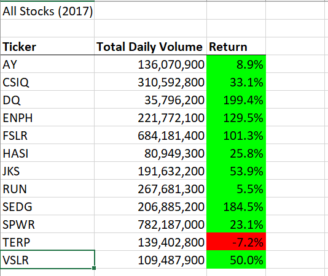
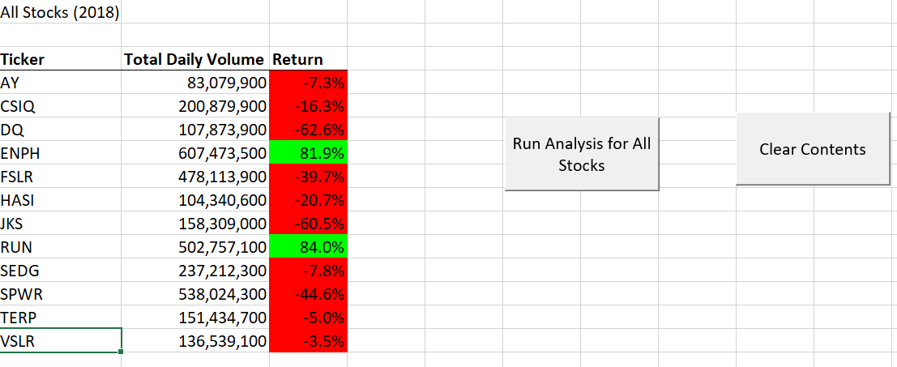

# stock-analysis

## Overview of Project

### Purpose
The purpose of this analysis is to find the trend for multiple stocks based on:
1. The amount/quantity of stocks sold throughout the year.
2. Fluctuation of stock price over whole year. 

## Results

### Results based on performance of stock in year 2017 and 2018 with original and refactored code
1. The number of stocks sold or the volume of stocks was way higher in 2018 than 2017 but by looking at the Return 
   it concludes that the stock overall did not perform well. 
2. Majority number of stock's prices fell throughout the year for 2018
   - Quantity of stocks and return for FY2017
     
   - Quantity of stocks and return for FY2018
     
2. 

## Summary
1. What are the advantages or disadvantages of refactoring code?
   
   Advantages :
   - By refactoring the code we improved the time complexity for the program. 
     The refactored code was able to traverse through 3000 rows in only 0.1 seconds which is almost less than qaurter time 
	 than non refactored code. 
   Disadvantages : 
   - For the refactored code to work the data needs to be sorted. 

